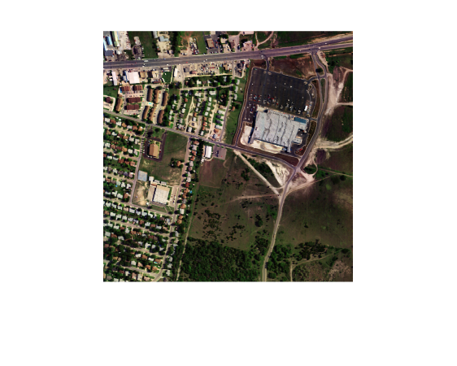
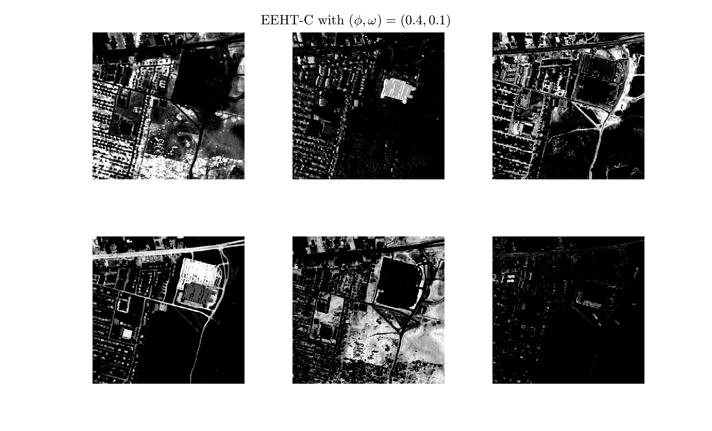

# EEHT - Efficient and Effective Implementation of Hottopixx Methods

This is a MATLAB code for the algoithm EEHT, presented in the paper "Tomohiko Mizutani, Implementing Hottopixx Methods for Endmember Extraction in Hyperspectral Images, arXiv, 2024".

## Prerequisites

You need to install CPLEX and enter the path of the installation directory to the file ``setPara.m``.
In addition, optimization toolbox is needed when reproducing the experiments in Sections VI-B and -C by using ``expExtnPerf.m`` and ``expUnmixUrban.m``.

## Quick Start

To run EEHT for a noisy separable matrix  $A = W H + N$ of size $d \times n$ with factorization rank $r$, type the command in the MATLAB command prompt.

```text
>> run_eeht
```

### Input

- ``d`` : Number of columns  
- ``n`` : Number of rows
- ``r`` : Factorization rank
- ``delta`` : Noise intensity, i.e, delta = $||N||_1$
- ``dataType`` : Choose 'normal' or 'ill-conditioned'
- ``cVal`` : Parameter for generating $\alpha$ such that
                     $\alpha^{(\text{r}-1)} = 10^{(-\text{cVal})}$
- ``seed`` : Seed number for generating random numbers
- ``flag_dispMatPara`` : Choose 1 if you display kappa, omega, beta, and condNum (condition number), of input matrix; otherwise, 0

The input matrices are the same as those of RHHP; see the [webpage](https://github.com/tomohiko-mizutani/RHHP) for the details.

### Output

- Recovery rates by EEHT-A, -B, -C

### Parameters

The parameters $\lambda, \mu$ are used for constructing an initial index set $\mathcal{L}$; see Algorithm 3 of the paper.
You can set the parameter values by editing the file 'setPara.m'.
The default values are $(\lambda, \mu) = (3, 15)$.
The following is the example of setting $(\lambda, \mu) = (5, 50)$.
 Open ``setPara.m`` and edit it as

```text
lambda = 5;  
mu = 50;
```

Note that the parameters $\lambda, \mu$ should be chosen to satisfy $\lambda r + \mu \le n$ for the number $n$ of columns of $A$ and the factorization rank $r$.

## Experiments in Sections VI-B - Endmember Extraction Performance
Section VI-B of the paper showed the experimental results on the endmember extraction performance of EEHT.
The experiments for datasets 1 and 2 can be reproduced by using ``expExtnPerf.m`` and ``dispRsltExtnPerf.m``.
The former one is for conducing experiments and the latter one is for plotting a graph for the results.
To run the codes, you need to set up the input argument ``datasetOpt`` according to the table below.

|``datasetOpt`` | Dataset for which you apply EEHT |
| --- | --- |
| 1 | Dataset 1|
| 2 | Dataset 2|

The following is the example for applying EEHT for dataset 1.
In the experiments, you are recommend to set $(\lambda, \mu) = (10,100)$.
To do so, edit  ``setPara.m`` as follows.

```text
lambda = 10;  
mu = 100;
```

Then, type the command for starting the experiments.

```text
>> expExtnPerf(1)
```

After the code has finished running, you get the output file ``rsltExtnPerf_dataset1.mat``.
You can display a graph for the results by using  ``dispRsltExtnPerf.m``.
Type the command

```text
>> dispRsltExtnPerf(1)
```

and then a graph is displayed.
The ``Result`` directory contains the output files ``rsltExtnPerf_dataset1.mat`` and ``rsltExtnPerf_dataset2.mat``. Below is the graphs generated from them.

<section style="text-align: center;">

&nbsp;　&nbsp;

</section>

## Experiments in Sections VI-C - Hyperspectral Unmixing of Urban HSI

Section VI-C of the paper showed the experimental results on hyperspectral unmixing of the Urban HSI.
The below is the RGB image of Urban.

<section style="text-align: center;">

</section>

You can run EEHT-C for unmixing Urban by using ``expUnmixUrban.m`` and ``dispRsltUnmixUrban.m``.
The former one is for unmixing Urban and the latter one is for plotting abundance maps.
To enhance the unmixing performance,
you are recommended to use a preprocessing technique with parameters $\phi$ and $\omega$ that is
described in Section VI-C.
By choosing the input argument ``preprocOpt`` of ``expUnmixUrban.m`` and ``dispRsltUnmixUrban.m``,
you can apply EEHT-C for Urban preprocessed with one of parameter values as shown in the table below.

| preprocOpt | Parameters $\phi, \lambda$ |
| --- | --- |
| 1   | $(\phi,\omega) = (0.4,0.1)$ |
| 2   | $(\phi,\omega) = (0.45,0.15)$ |
| 3   | $(\phi,\omega) = (0.5,0.3)$ |
| 4   | $(\phi,\omega) = (0.55,0.45)$ |
| 5   | $(\phi,\omega) = (0.6,0.6)$ |

The following is the example for applying EEHT-C for Urban with $(\phi, \omega)=(0.4, 0.1)$.
You are recommend to set $(\lambda, \mu) = (50,300)$.
To do so, edit  ``setPara.m`` as follows.

```text
lambda = 50;  
mu = 300;
```

Then, type the command for applying EEHT-C with preprocessing with $(\phi, \omega)=(0.4, 0.1)$ for Urban.

```text
>> expUnmixUrban(1)
```

After the code has finished running, you get the output file ``rsltUnmixing_preproc1.mat``.
You can display the abundance maps of Urban obtained by EEHT-C by using  ``dispRsltUnmixUrban.m``.
Type the command

```text
>> dispRsltUnmixUrban(1)
```

and then abundance maps are shown.
The ``Result`` directory contains five output files
``rsltUnmixing_preproc1.mat``, ..., ``rsltUnmixing_preproc5.mat``
Below is the abundance maps generated from ``rsltUnmixing_preproc1.mat``.

<section style="text-align: center;">

</section>

---
Contact: Tomohiko Mizutani [(mizutani.t@shizuoka.ac.jp)](mailto:mizutani.t@shizuoka.ac.jp)
